# TP4 – Réseau
**Cours : Réseau**

**Travail pratique 4 : Routage inter-VCN oracle cloud,
configuration d'un Serveur DHCP et évaluation de
la performance d'un réseau**

---

# === Configuration du routage inter-VCN ===

## BUT :
Créer plusieurs VCN's dans Oracle Cloud ayant des blocs CIDR ne se
chevauchent pas. À cette fin, allez lire la section `Sommaire des composants de
réseau pour l'appairage au moyen d'une passerelle DRG` à ce lien.

## 1. Création des 2 VCN et des deux instances avec Ubuntu 22.04

### 1.1 — Création des VCN
- **vcn1** : CIDR `10.0.0.0/16`
- **vcn2** : CIDR `10.1.0.0/16`


Chaque VCN contient un sous-réseau public :
  - `10.0.0.0/24` pour le vcn1

Photo qui montre le sous-réseau du vcn1:

  - `10.1.0.0/24` pour le vcn2

Photo qui montre le sous-réseau du vcn2:

    
- On ajoute une **Internet Gateway** et une **table de routage** par défaut à chaque VCN.


### 1.2 — Création des instances Ubuntu 22.04
On crée **une instance Ubuntu 22.04** dans chaque VCN.

#### Étapes de création d'une instance Ubuntu 22.04
- 1. On se connecte à notre compte Oracle Cloud (compte déjà créé dans mon cas)
  

- 2. On accède au menu principal et on regarde sur accueuil → Compute → Instances.
  
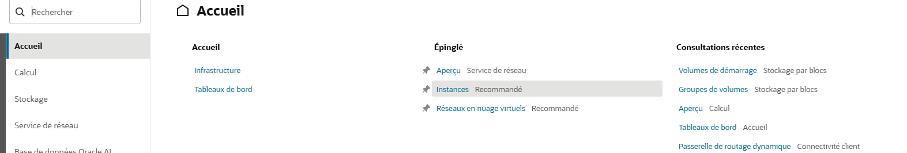
- 3. On clique sur Créer une instance.
  
- 4. On renseigne le nom de l’instance (ex. Ubuntu-VCN1) et on sélectionne le compartiment où sera créée l'instance.

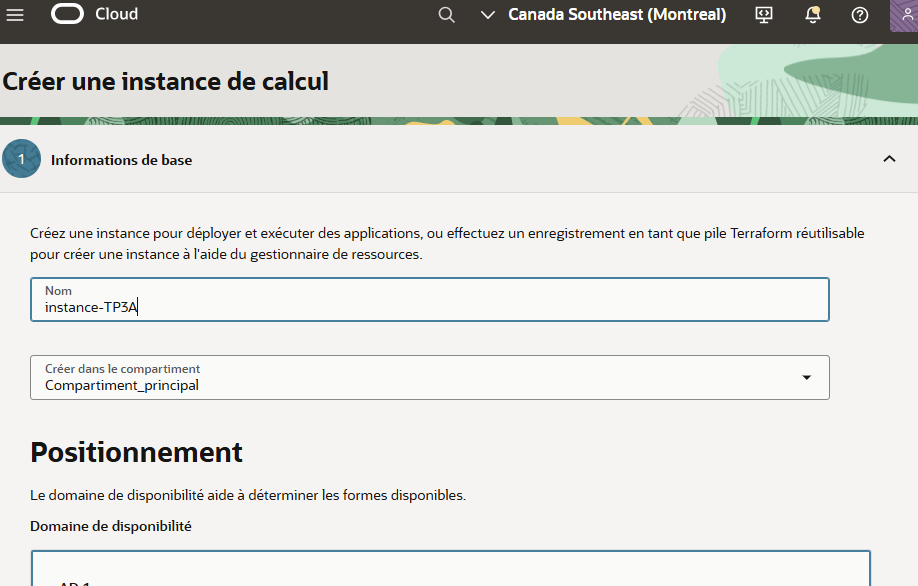
- 5. On choisit l’image Ubuntu 22.04 LTS dans la section Image et forme.

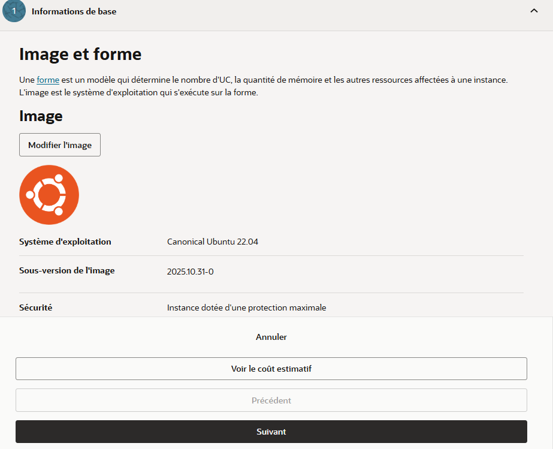
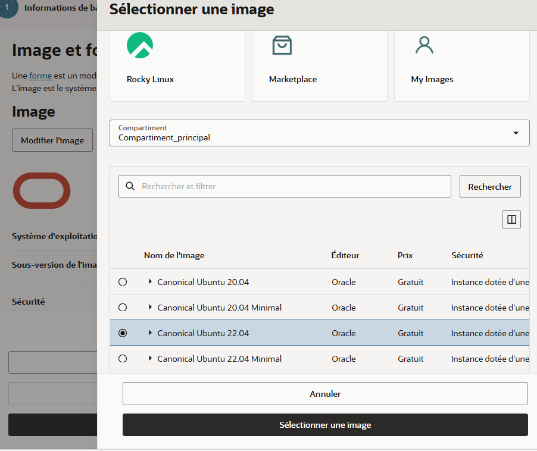
- 6. À l'étape 3 de service du réseau, on sélectionne (si c'est votre cas, un réseau en nuage virtuel existant)

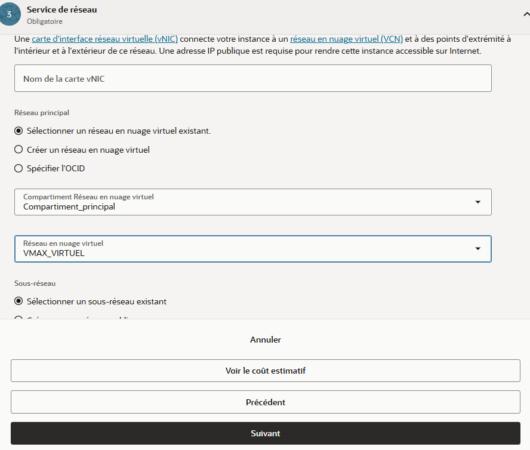
- 7. On ajoute sa clé SSH publique pour pouvoir se connecter à l’instance. Si vous n'avez pas de clé SSH en main, juste à cliquer sur **télécharger la clé privée** et **télécharger la clé publique**

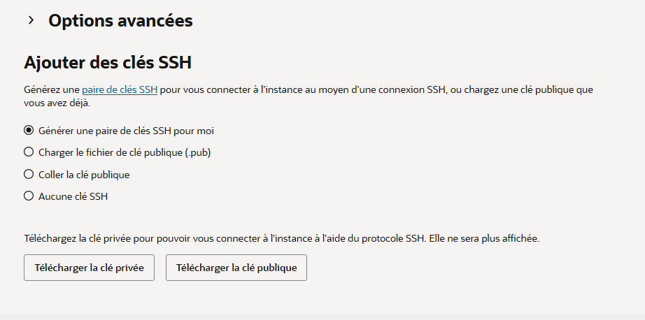
- 8. On vérifie les configurations réseau : IP publique si nécessaire et règles du NSG ou Security List pour autoriser SSH.

- 9. On clique sur Créer l’instance et on attend que son statut devienne Running.

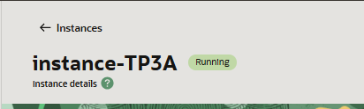
- 10. On se connecte à l’instance depuis son terminal avec ssh:

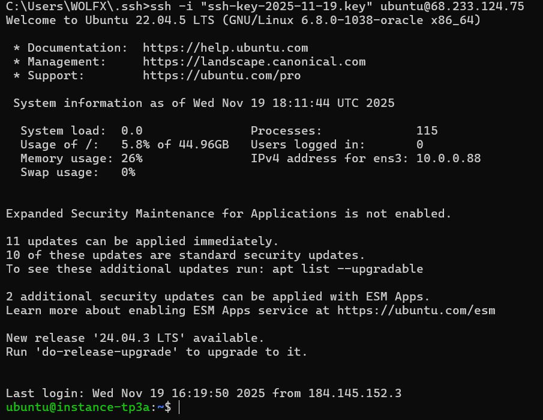

- 11. On répète les mêmes étapes pour la création de la deuxième instance.


---

**Petite erreur avant d'analyser:** Mon collègue a nommé les instances communément (instance-TP3A) et (instance-TP3B), alors qu'on est sur le travail pratique 4. C'est juste un problème de nommage, svp ne pas nous faire perdre des points là-dessus.      
- **instance-TP3A** : rattachée au vcn1.

  
- **Instance-TP3B** : rattachée au vcn2.  


- On ouvre les ports suivants :
  - **ICMP (Ping)** pour les tests de communication
  - **22 (SSH)** pour la connexion


## Étape 2 — Création de la passerelle DRG

1. On va dans **Networking → Dynamic Routing Gateways**
2. On clique sur **Create DRG**
3. On nomme la passerelle : `DRG-TP4`

Voici la preuve:


## Étape 3 — Attachement des VCN créés prédécemment à la passerelle DRG

1. Dans la section **Attachments**, on crée une attache pour :
   - `vcn1`
   - `vcn2`
2. On vérifie que les deux VCN apparaissent dans la liste des attachements de la DRG.


## Étape 4 — Configuration des tables de routage

### 4.1 — Dans le VCN A
- On ajoute une route dans la table :
  - **Destination CIDR** : `10.1.0.0/16`
  - **Target Type** : DRG


### 4.2 — Dans le VCN B
- On ajoute une route :
  - **Destination CIDR** : `10.0.0.0/16`
  - **Target Type** : DRG


---

## Étape 5 — Mise à jour des règles de sécurité

### 5.1 — Dans le vcn1
- On autorise :
  - **Type** : ICMP (Ping)
  - **Source CIDR** : `10.1.0.0/16`


### 5.2 — Dans le vcn2
- On autorise :
  - **Type** : ICMP (Ping)
  - **Source CIDR** : `10.0.0.0/16`


---

## Étape 6 — Preuve de ping 

### 6.1 — Ping vers instance TP3_A
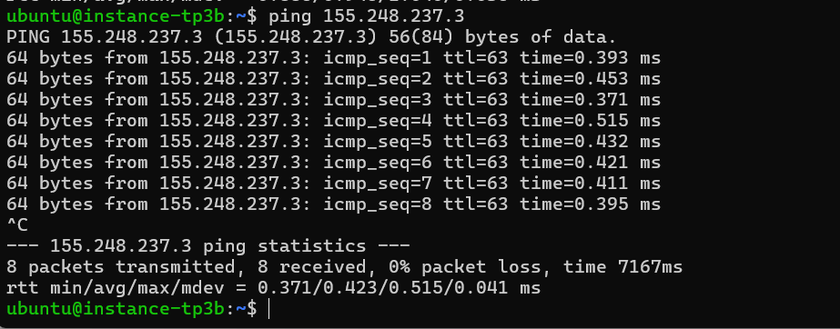

### 6.2 — Ping vers instance TP3_B
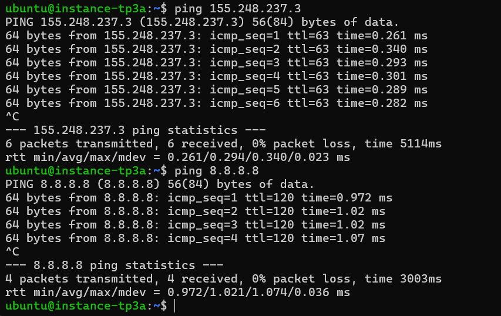

---

# === Évaluation de la performance réseau ===

## Étape 7 — Évaluation de la performance réseau

On pourra procéder à un test de performance à l’aide de l’utilitaire **iperf3**.  
Pour installer et utiliser iperf3, on suit les étapes ci-dessous.

### 7.1 — Installation de iperf3
On installe iperf3 sur **les deux instances** :

```bash
sudo apt update
sudo apt install iperf3 -y
```

### 7.2 — Lancement de iperf3 en mode serveur (sur l’instance du vcn1)

# 📌 Tests de performance réseau avec iPerf3

Cette section présente les étapes de configuration, de diagnostic et de validation du débit entre les deux instances OCI à l’aide de l’outil **iPerf3**.

---

## 🔧 1. Vérification et réinitialisation du pare-feu (iptables)

Avant de lancer les tests, nous avons identifié que le trafic était bloqué par **iptables**.  
Nous avons donc vidé toutes les règles et mis les politiques par défaut à **ACCEPT**.

```bash
sudo iptables -F
sudo iptables -X
sudo iptables -t nat -F
sudo iptables -t nat -X
sudo iptables -t mangle -F
sudo iptables -t mangle -X

sudo iptables -P INPUT ACCEPT
sudo iptables -P FORWARD ACCEPT
sudo iptables -P OUTPUT ACCEPT
```


---

## 🔥 2. Vérification des règles de sécurité OCI (Security Lists)

### Instance A (10.0.0.88)


### Instance B (10.1.0.96)


Règles importantes :

| Direction | Source / Destination | Protocole | Ports |
|----------|-----------------------|-----------|--------|
| Ingress  | 10.0.0.0/24 ou /16     | TCP       | 5201   |
| Egress   | 10.0.0.0/24 ou /16     | All       | All    |
| Ingress  | 10.1.0.0/24 ou /16     | TCP       | 5201   |

---

## 🚀 3. Lancement du serveur iPerf3 sur l’instance B (10.1.0.96)

```bash
iperf3 -s -B 10.1.0.96
```


---

## 📡 4. Exécution du client iPerf3 sur l’instance A (10.0.0.88)

```bash
iperf3 -c 10.1.0.96
```


---

## 📊 5. Résultats obtenus

| Instance   | Rôle     | Débit moyen observé |
|------------|----------|----------------------|
| Instance A | Client   | ~502 Mbits/sec       |
| Instance B | Serveur  | ~497 Mbits/sec       |

---

## ✅ Conclusion

Nous avons :

✔ Diagnostiqué pourquoi le port 5201 ne répondait pas  
✔ Réinitialisé correctement iptables  
✔ Validé les règles OCI pour permettre le trafic inter-VCN  
✔ Réalisé un test iPerf3 fonctionnel avec ~500 Mbits/sec de bande passante  


### 7.4 — Résultats du test

iperf3 affiche automatiquement :

- la bande passante (Mbits/sec),
- la quantité de données transmises,
- la durée du test,
- un résumé global de la performance.

Ce test permet de confirmer :

- que le routage inter-VCN fonctionne,
- que les deux instances peuvent communiquer sans restriction,
- et d’évaluer la performance réseau fournie par Oracle Cloud.

--- 

# === Mise en place un serveur DHCP ===

# DHCP – Serveur et Relay

## 1. Installation et configuration du serveur DHCP (Instance B – 10.1.0.96)

###  Installation du service

On installe le serveur DHCP sur l’instance B avec la commande :
```bash
sudo apt install isc-dhcp-server -y
```

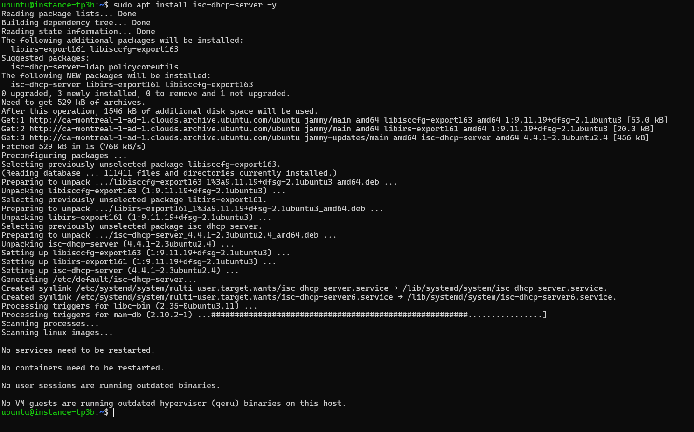

###  Fichier `/etc/default/isc-dhcp-server`
On édite le fichier /etc/default/isc-dhcp-server pour préciser l’interface réseau sur laquelle le DHCP doit écouter :
```bash
INTERFACESv4="ens3"
INTERFACESv6=""
```


###  Configuration du DHCP : `/etc/dhcp/dhcpd.conf`
On édite le fichier /etc/dhcp/dhcpd.conf pour définir les paramètres du DHCP, comme le nom du serveur, le domaine, les DNS et la plage d’adresses à attribuer :
```conf
server-name "dhcp.vcnb.lan";

authoritative;
option domain-name "vcnb.lan";
option domain-name-servers 8.8.8.8, 1.1.1.1;

ddns-update-style none;

default-lease-time 3600;
max-lease-time 7200;

subnet 10.1.0.0 netmask 255.255.255.0 {
  option broadcast-address 10.1.0.255;
  option routers 10.1.0.1;
  option domain-name-servers 8.8.8.8, 1.1.1.1;
  range 10.1.0.50 10.1.0.150;
  ping-check true;
}
```

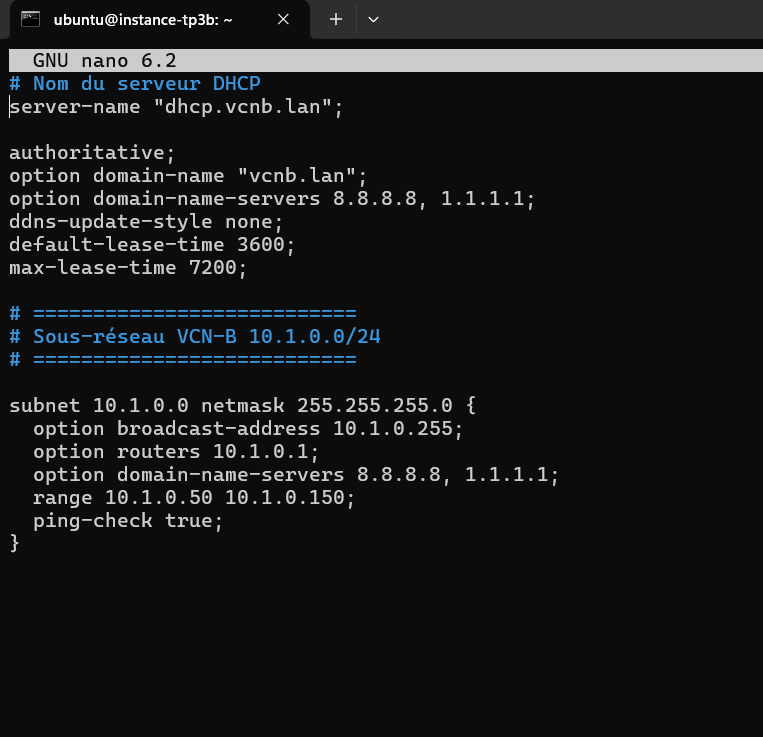

###  Statut du service
On redémarre le serveur DHCP pour appliquer les changements et nn vérifie que le service est actif et fonctionne correctement :
```bash
sudo systemctl restart isc-dhcp-server
sudo systemctl status isc-dhcp-server
```

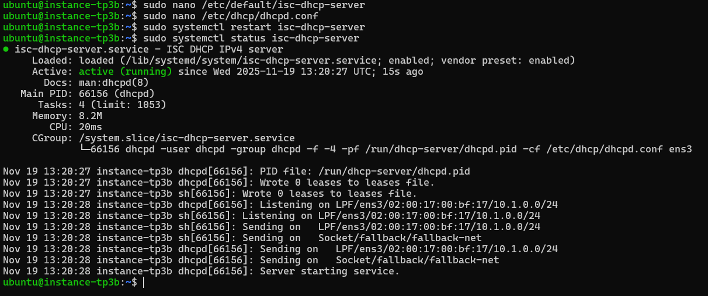

###  Règles de pare-feu Oracle Cloud
On s’assure que les règles du pare-feu autorisent le trafic DHCP (ports UDP 67 et 68):
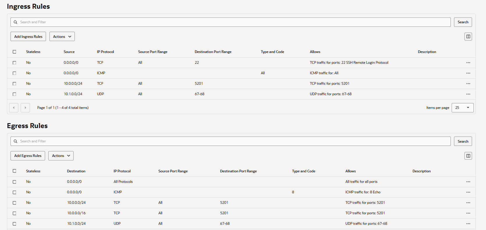

---

##  2. Installation et configuration du DHCP Relay (Instance A – 10.0.0.49)

###  Installation
On installe le relais DHCP sur l’instance A :
```bash
sudo apt install isc-dhcp-relay -y
```

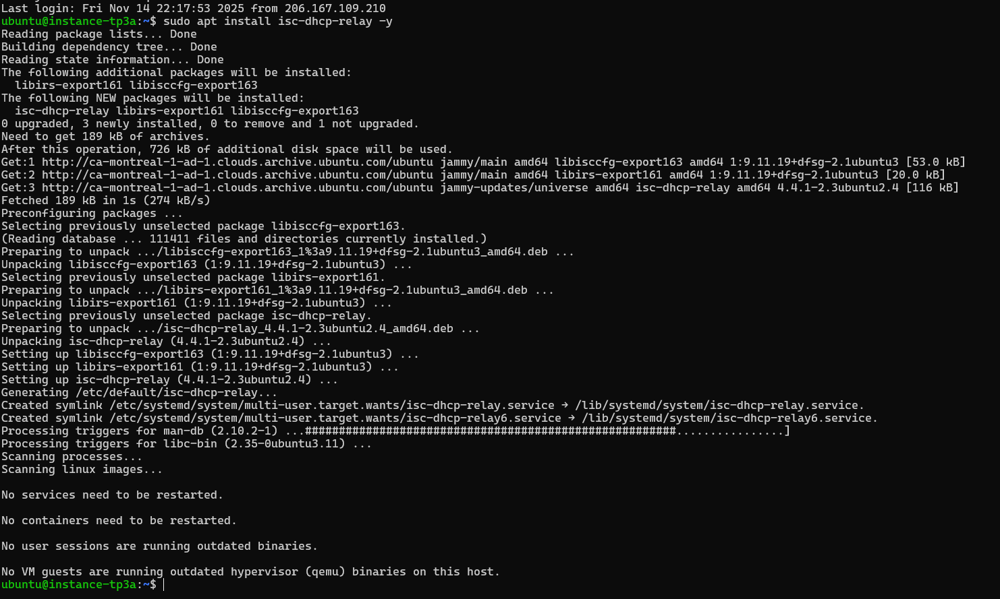

###  Fichier `/etc/default/isc-dhcp-relay`
On édite le fichier /etc/default/isc-dhcp-relay pour définir l’adresse du serveur DHCP et l’interface à écouter :

```conf
SERVERS="10.1.0.96"
INTERFACES="ens3"
OPTIONS=""
```

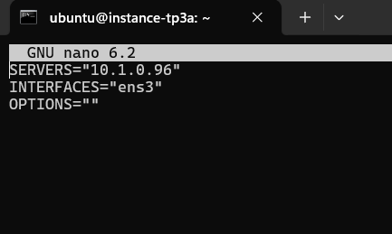

###  Vérification du service
On redémarre le service DHCP Relay et on vérifie que le service fonctionne correctement :
```bash
sudo systemctl restart isc-dhcp-relay
sudo systemctl status isc-dhcp-relay
```

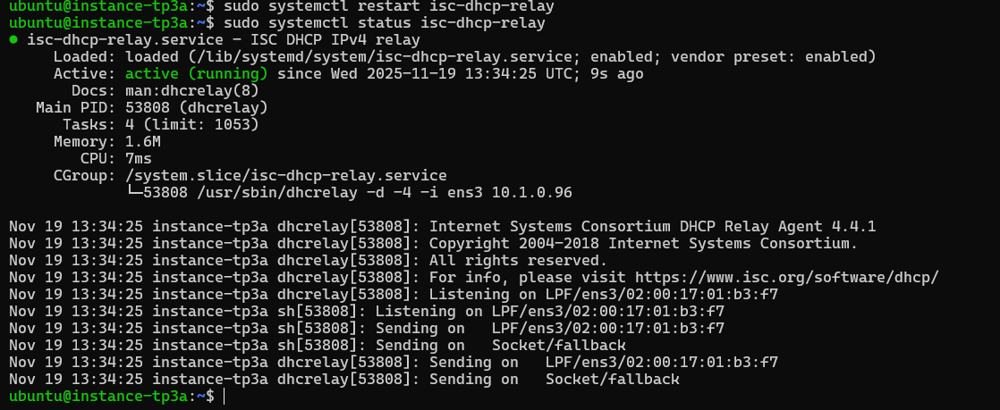

---


