# TP4 – Réseau
**Cours : Réseau**  
**Travail pratique 4 : Routage inter-VCN oracle cloud,
configuration d'un Serveur DHCP et évaluation de
la performance d'un réseau**

---

# === Configuration du routage inter-VCN ===

## BUT :
Créer plusieurs VCN's dans Oracle Cloud ayant des blocs CIDR ne se
chevauchent pas. À cette fin, allez lire la section `Sommaire des composants de
réseau pour l'appairage au moyen d'une passerelle DRG` à ce lien.

## 1. Création des 2 VCN et des deux instances avec Ubuntu 22.04

### 1.1 — Création des VCN
- **vcn1** : CIDR `10.0.0.0/16`
- **vcn2** : CIDR `10.1.0.0/16`


Chaque VCN contient un sous-réseau public :
  - `10.0.0.0/24` pour le vcn1

Photo qui montre le sous-réseau du vcn1:
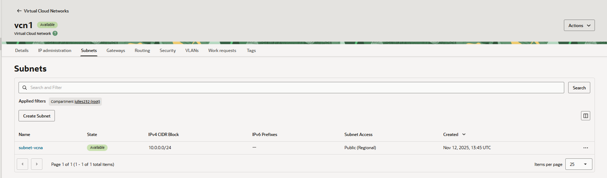
  - `10.1.0.0/24` pour le vcn2

Photo qui montre le sous-réseau du vcn2:
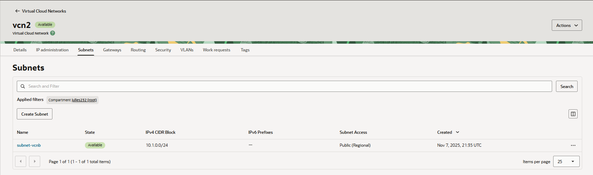
    
- On ajoute une **Internet Gateway** et une **table de routage** par défaut à chaque VCN.


### 1.2 — Création des instances Ubuntu 22.04
- Créer **une instance Ubuntu 22.04** dans chaque VCN.


**Petite erreur avant d'analyser:** Mon collègue a nommé les instances communément (instance-TP3A) et (instance-TP3B), alors qu'on est sur le travail pratique 4. C'est juste un problème de nommage, svp ne pas nous faire perdre des points là-dessus.      
- **instance-TP3A** : rattachée au vcn1.

  
- **Instance-TP3B** : rattachée au vcn2.  


- Ouvrir les ports suivants :
  - **ICMP (Ping)** pour les tests de communication
  - **22 (SSH)** pour la connexion


## Étape 2 — Création de la passerelle DRG

1. On va dans **Networking → Dynamic Routing Gateways**
2. On clique sur **Create DRG**
3. On nomme la passerelle : `allo`

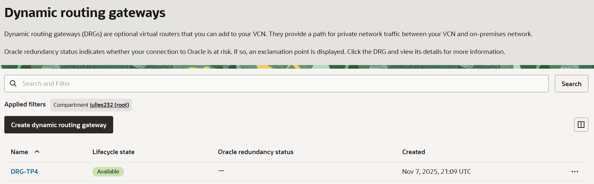

## Étape 3 — Attachement des VCN créés prédécemment à la passerelle DRG

1. Dans la section **Attachments**, on crée une attache pour :
   - `vcn1`
   - `vcn2`
2. On vérifie que les deux VCN apparaissent dans la liste des attachements de la DRG.

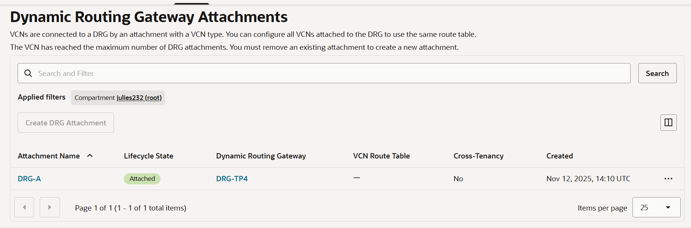
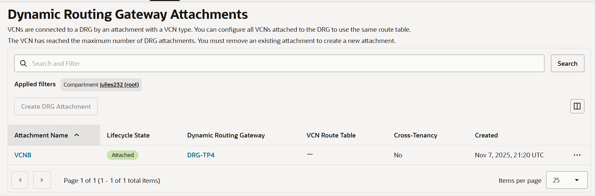

## Étape 4 — Configurer les tables de routage

### 4.1 — Dans le VCN A
- On ajoute une route dans la table :
  - **Destination CIDR** : `10.1.0.0/16`
  - **Target Type** : DRG

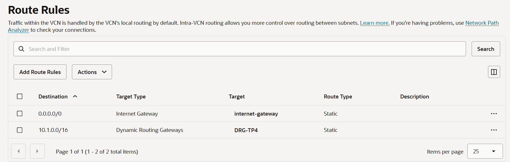

### 4.2 — Dans le VCN B
- Ajouter une route :
  - **Destination CIDR** : `10.0.0.0/16`
  - **Target Type** : DRG

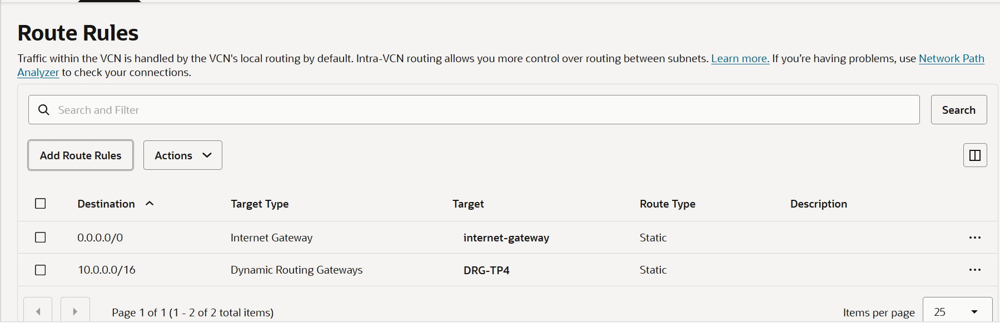

---

## 🔒 Étape 5 — Mettre à jour les règles de sécurité

### 5.1 — Dans le VCN A
- Autoriser :
  - **Type** : ICMP (Ping)
  - **Source CIDR** : `10.1.0.0/16`

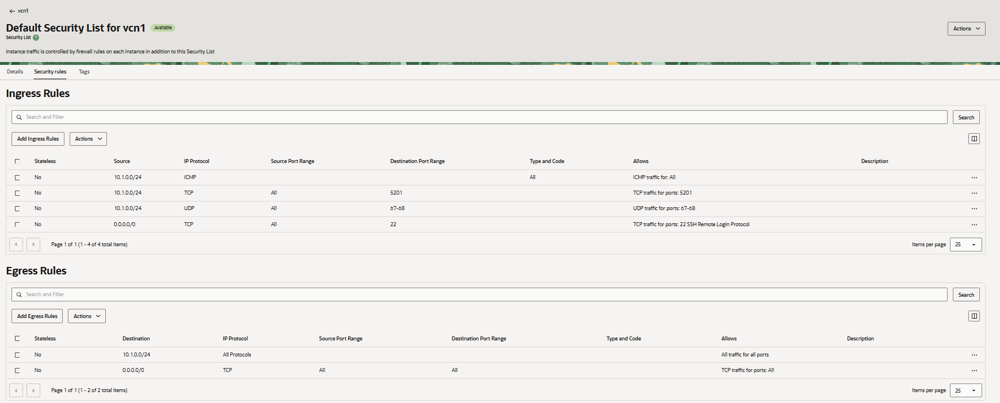
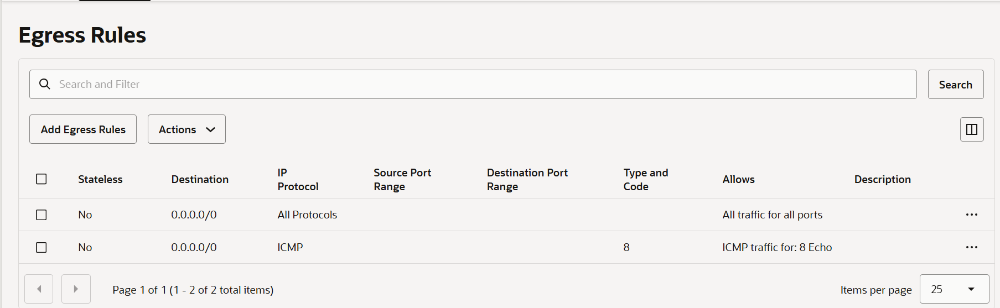

### 5.2 — Dans le VCN B
- Autoriser :
  - **Type** : ICMP (Ping)
  - **Source CIDR** : `10.0.0.0/16`

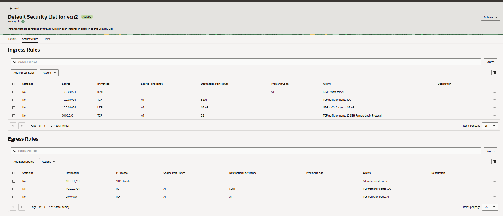
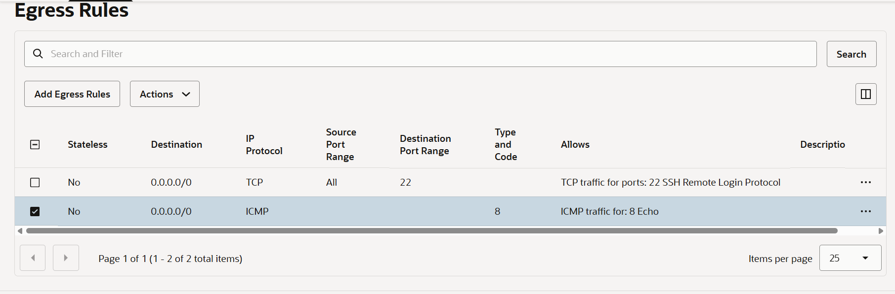

---

## Étape 6 — Test de connectivité

### 6.1 — Connexion SSH
Depuis votre poste local :
```bash
ssh ubuntu@<IP_publique_instance_A>
