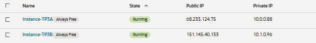
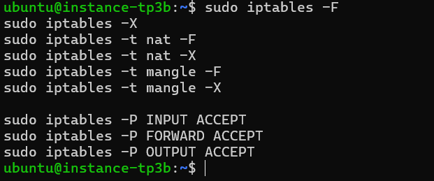
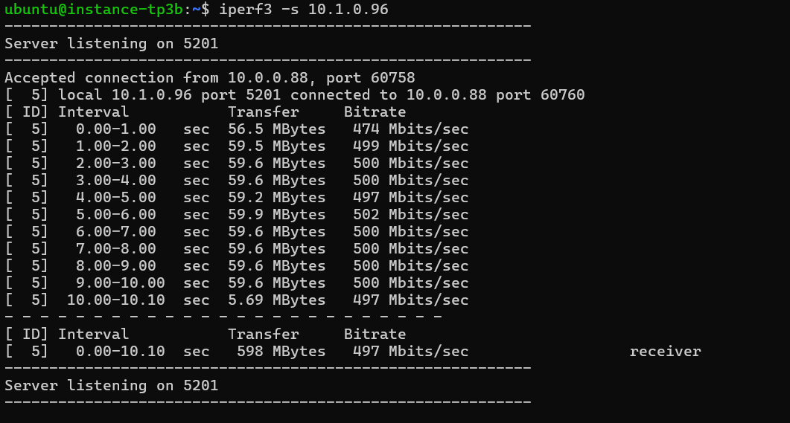
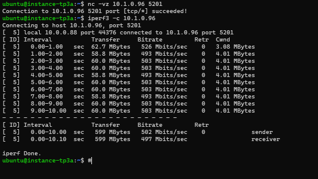

# TP4 – Réseau
**Cours : Réseau**  
**Travail pratique 4 : Routage inter-VCN Oracle Cloud, configuration d’un serveur DHCP et évaluation de la performance d’un réseau**

---

# === Configuration du routage inter-VCN ===

## **BUT**
Le but est de créer plusieurs VCN dans Oracle Cloud avec des blocs CIDR **qui ne se chevauchent pas**.  
Pour ce faire, il faut consulter la section *« Sommaire des composants de réseau pour l’appairage au moyen d’une passerelle DRG »*.

---

# 1. Création des deux VCN et instances Ubuntu 22.04

## 1.1 — Création des VCN
- **vcn1** : ==CIDR== `10.0.0.0/16`  
- **vcn2** : CIDR `10.1.0.0/16`


Chaque VCN contient un sous-réseau public :
- `10.0.0.0/24` pour **vcn1**


- `10.1.0.0/24` pour **vcn2**


Une **Internet Gateway** et une **table de routage par défaut** sont ajoutées à chaque VCN.

---

## 1.2 — Création des instances Ubuntu 22.04

On crée **une instance Ubuntu 22.04 par VCN**.

### Étapes :
1. Connexion à Oracle Cloud


2. Menu principal → Accueil → Compute → Instances


3. On clique sur **Créer une instance**
4. On donne un nom à l’instance (ex. *Ubuntu-VCN1*) et choisir le compartiment


5. On sélectionne l’image **Ubuntu 22.04 LTS**


6. Dans l’étape réseau, on sélectionne le VCN existant


7. On ajoute sa clé SSH publique.  
   Si vous n’en avez pas, télécharger la paire de clés directement.


8. On vérifie les règles réseau (NSG/Security List pour SSH)
9. On clique sur **Créer l’instance** et attendre le statut **Running**


10. Connexion à l’instance avec SSH


11. On répéte pour la deuxième instance



---

### Instances créées
- **instance-TP3A** : attachée à **vcn1**


- **instance-TP3B** : attachée à **vcn2**


---

# 2. Création de la passerelle DRG

1. On va dans **Networking → Dynamic Routing Gateways**
2. On clique sur **Create DRG**
3. On nomme la passerelle : `DRG-TP4`


---

# 3. Attachement des VCN à la DRG

Dans **Attachments**, on crée une attache pour :
- **vcn1**

- **vcn2**


---

# 4. Configuration des tables de routage

## 4.1 — VCN A
Route à ajouter :
- **Destination CIDR** : `10.1.0.0/16`
- **Target** : **DRG**


## 4.2 — VCN B
Route à ajouter :
- **Destination CIDR** : `10.0.0.0/16`
- **Target** : **DRG**


---

# 5. Mise à jour des règles de sécurité

## 5.1 — Subnet A  
On autorise :
- **Type** : ICMP (ping)
- **Source CIDR** : `10.1.0.0/24`


## 5.2 — Subnet B  
On autorise :
- **Type** : ICMP (ping)
- **Source CIDR** : `10.0.0.0/24`


---

# 6. Preuve de ping
Ici, on vérifie la connectivité réseau entre les instances en utilisant la commande ping.

## Vers l’instance TP3_A


## Vers l’instance TP3_B


---

# === Évaluation de la performance réseau ===

# 7. Tests de performance avec iPerf3
Cette section présente les étapes de configuration, de diagnostic et de validation du débit entre les deux instances OCI à l’aide de l’outil **iPerf3**.

## 7.1 — Installation de iPerf3

Sur **les deux instances**, on doit faire les commandes suivantes pour installer **iPerf3** :

```bash
sudo apt update
sudo apt install iperf3 -y
```

## 7.2 — Réinitialisation du pare-feu (iptables)
On supprime toutes les règles existantes du pare-feu pour éviter que le trafic iPerf3 soit bloqué.
On s’assure ainsi que les ports nécessaires sont ouverts pour les tests de débit.




## 7.3 — Règles de sécurité OCI
On vérifie les listes de sécurité (Security Lists) pour chaque instance afin de s’assurer que le trafic iPerf3 est autorisé.

### Instance A (10.0.0.88)


### Instance B (10.1.0.96)


## 7.4 — Lancement du serveur iPerf3 (Instance B)
On démarre iPerf3 en mode serveur sur l’Instance B.
On lie le serveur à l’adresse IP 10.1.0.96 pour que le client puisse s’y connecter spécifiquement.

```bash
iperf3 -s -B 10.1.0.96
```




## 7.5 — Lancement du client iPerf3 (Instance A)
On fait la même chose qu'à l'étape 7.4, sauf avec l'instance A:

```bash
iperf3 -c 10.1.0.96
```




## 7.6 — Résultats
On observe que le débit mesuré entre les deux instances est proche de 500 Mbits/s, ce qui indique une connexion stable et performante. On peut donc valider que le réseau OCI entre ces deux instances est bien configuré pour des communications à haut débit.

| Instance   | Rôle     | Débit observé |
|------------|----------|----------------|
| Instance A | Client   | ~502 Mbits/s   |
| Instance B | Serveur  | ~497 Mbits/s   |

---

# === Mise en place d’un serveur DHCP ===

# 1. Serveur DHCP (Instance B – 10.1.0.96)

## 1.1 —  Installation
On installe le serveur DHCP sur l’instance pour pouvoir attribuer automatiquement des adresses IP aux clients du réseau.
```bash
sudo apt install isc-dhcp-server -y
```


## 1.2 — Fichier `/etc/default/isc-dhcp-server`
On configure le serveur DHCP pour qu’il écoute uniquement sur l’interface réseau ens3.
On laisse IPv6 vide car le réseau utilise uniquement IPv4.
```conf
INTERFACESv4="ens3"
INTERFACESv6=""
```


## 1.3 — Fichier `/etc/dhcp/dhcpd.conf`
On définit dans ce fichier la plage d’adresses IP à distribuer, le masque de sous-réseau, la passerelle et d’autres options DHCP.


## 1.4 — Statut du service DHCP
On vérifie que le service DHCP est actif et fonctionne correctement.


## 1.5 — Règles de pare-feu DHCP
On configure les règles de sécurité pour autoriser le trafic DHCP (ports 67 et 68 UDP) entre le serveur et les clients.


---

# 2. DHCP Relay (Instance A – 10.0.0.49)

## 2.1 — Installation
On installe le relais DHCP pour permettre aux clients d’un autre sous-réseau d’obtenir une adresse IP du serveur DHCP.
On utilise -y pour valider automatiquement l’installation.

```bash
sudo apt install isc-dhcp-relay -y
```


## 2.2 — Fichier `/etc/default/isc-dhcp-relay`
On configure le relais pour qu’il connaisse l’adresse du serveur DHCP et les interfaces réseau à surveiller.
On permet ainsi la redirection des requêtes DHCP vers le serveur principal.


## 2.3  — Statut du relais
On vérifie que le service de relais DHCP est actif et fonctionne correctement.


---

## === Fin ===
